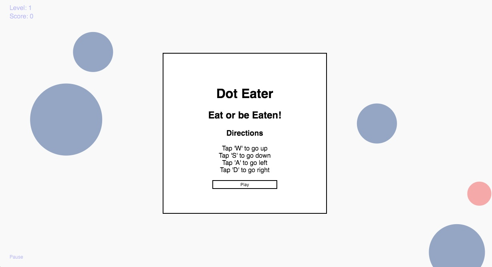
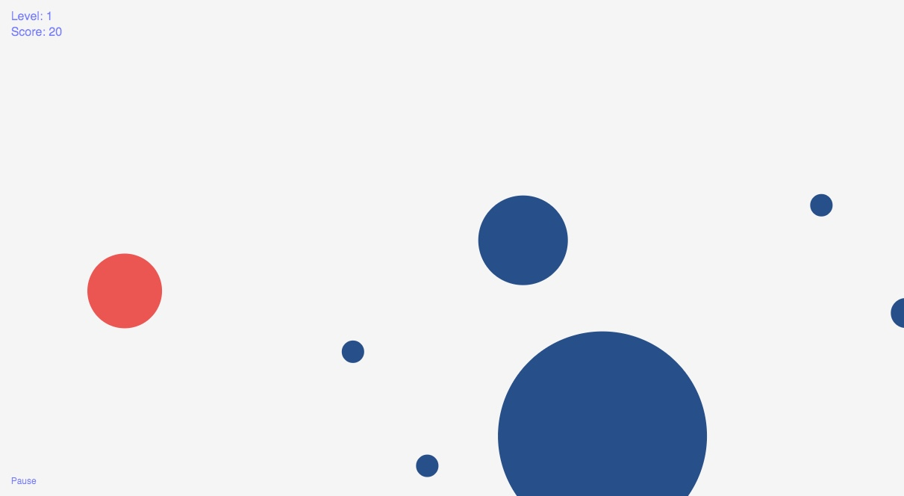
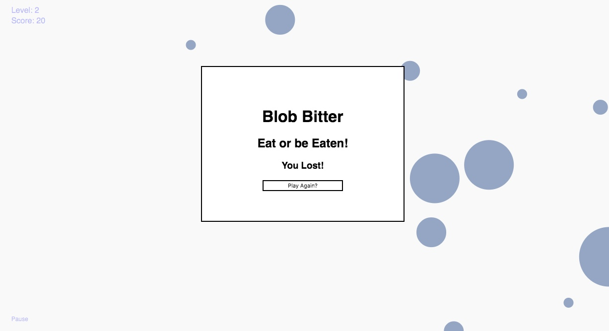

#Dot Eater Game

##About

[Dot Eater Live](https://evandapolarbear.github.io/dot_eater_game/)

In this game(inspired by [agar](agar.io)), a player attempts to guide their dot so that it eats
smaller dots smaller than themselves, while avoiding getting eaten by larger dots.

The game has a minimalist design and infinite levels making it a good way to unwind after a
stressful day

##Photos

##Features and Implementation

###Levels
The next level is reached when there are only 2 dots left on the screen or when all the remaining dots are
all the same radius.  In order to add more dots and keep the game going the dots left over are frozen and
the window fades out by adding a class to the element and using the css transition property.  The same function
that adds the class to the DOM element also invokes 2 asynchronous timeout functions. The first waits until the transition
has completely taken effect then it shrinks the radius of the remaining dots, adds more computer dots, and then
removes the opacity class from the element. This causes the screen to be repopulated while it fades back in.
The second asynchronous call unfreezes the dots when the fade in is almost complete and updates the level counter.

###Physics
Each dot is represented on the backend by an Object that keeps track of its current position and
velocity.  Whenever a cell is generated, it is assigned a random velocity.  When a dot collides with
the edge of the browser window a function is called that determines what edge was hit by a dots
position and then recalculates the vector of that cell.  At each step of movement, a function is
called to check if any dots have overlapping radiuses.  If they do a second function is called,
where both dots are passed as arguments. This second function determines which dot is bigger then
erases the smaller dot and adds its radius to the radius of the larger dot.  If the dots have the
same radius the function is a no op.

###User Controls
Javascript event listeners were added to "W", "S", "A", & "D" and the arrow keys to allow users
to control their dot.  Each time an event listener fires its corresponding direction has one added
to it. Before one is added though, a function is executed to ensure that the velocity in any one direction
has not gotten too large. I did this to keep the game interesting and the players dot controllable.

##Ideas for future development

###Computer dot AI
The next most obvious step would be to make it so that computer dots chase dots smaller than them and run
from dots larger then them.  The easiest way to implement this would be to have every dot find its nearest
neighbor at each step and then decide to either go towards it or away from it.

###Limit Speed Based On Size
This would make the game much more challenging and would not be all that difficult. To Implement this feature
I would simply change the function that currently limits the speed of the player dot, and refactor it so that
it also took in a radius and then apply it to all cells whenever their vector was about to update.
