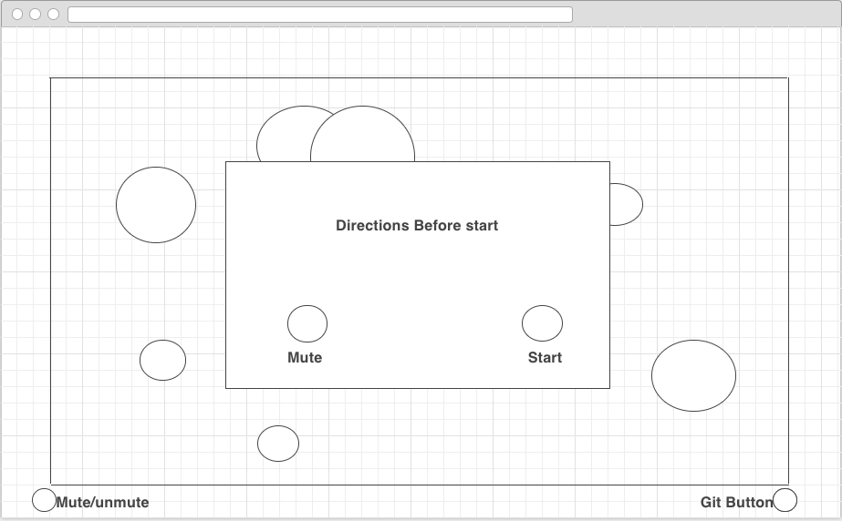
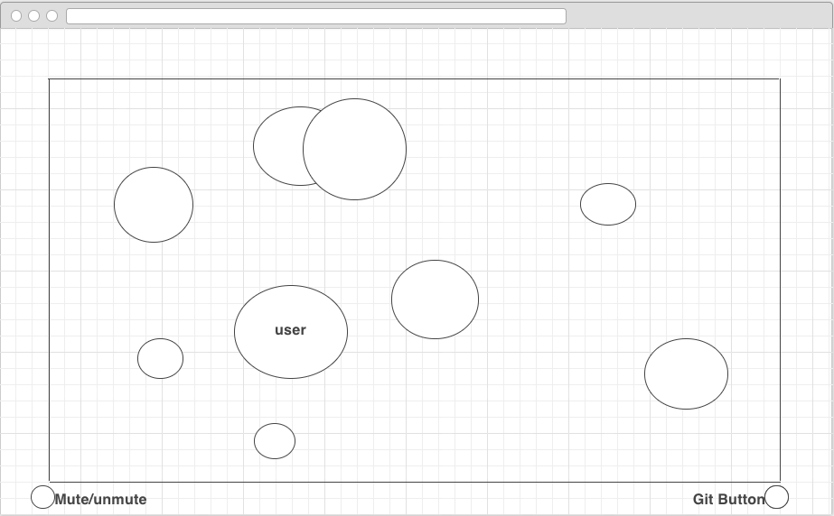

#Dot Eater Game

In this game, one player will attempt to guide their cell so that it eats
smaller cells and avoids getting eaten by larger cells.  It will be similar
to [agar](agar.io) but single player.  The game will continue until the player
has eaten all other cells or been eaten themselves.

##Functionality and MVPs
- [ ] Modal on enter that explains rules.
- [ ] Ability for user to control cell.
- [ ] All cells being able to eat one another and grow appropriately after.
- [ ] Music that auto plays but can be paused.

Additionally this project will include a production README.

##Wireframes
My game will consist of a single screen a large window for game play and
buttons on the bottom that link to this github.  Additionally, there will be
pause button described in the bonus features if time allows.

##Architecture and Technologies.

I will these technologies to implement this project:
* Webpack to bundle my JS files into an entry file.
* HTML Canvas to animate all cells and control opposition cells.
* Vanilla javascipt to allow the user to control their cell.

Besides my entry file, I will have a screen.js file that will take care of
tracking and rendering all cells and their collisions.

I will also have a user.js file to track the user input and give the
appropriate inputs to the screen.js.

##Implementation Timeline

###Day 1
Get all setup done on the project including installing webpack.
I also will need to begin remembering Canvas.

Goals:
* Get all setup done.
* Relearn enough Canvas to get static shapes to show up in the browser.
* Deploy site to github pages

###Day 2
Get canvas to animate random movements and deal with collisions of cells.

Goals:
* Have Cells that move at random.
* When two cells collide have the larger one absorb the smaller one.

###Day 3
Use Vanilla javascript to allow the player to control their own cell.
Also create links to github and get a media player that allows for paused
music.

Goals:
* Allow user to pilot a cell around the map using arrow keys
* Add github link
* Add media Player and pause button

###Day 4
Finish styling all elements and fix any remaining bugs

Goals:
* Have a fully working game

##Bonus
- [ ] Add new enemies at random times from offscreen.
- [ ] Zoom out as player gets bigger.
- [ ] Give enemy cells a simple AI.
